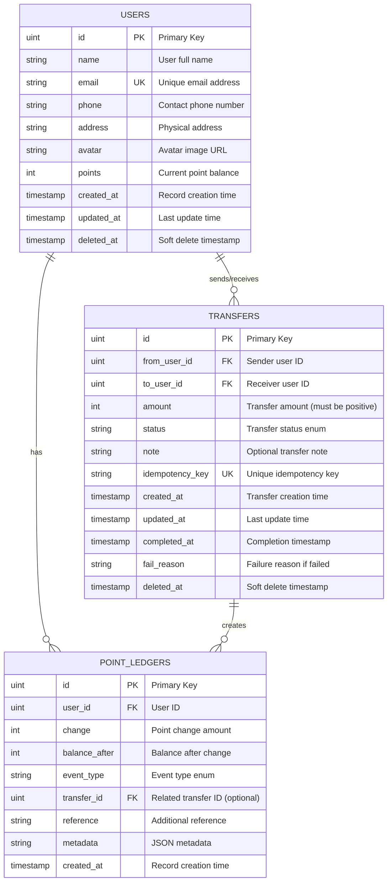

# Database Documentation

## Overview

This document describes the database schema for the Go Fiber Point Transfer System. The system manages users, point transfers between users, and maintains an audit trail of all point movements through a ledger.

## Entity Relationship Diagram



## Database Tables

### 1. USERS

**Purpose**: Stores user account information and current point balance.

| Column     | Type      | Constraints                 | Description               |
| ---------- | --------- | --------------------------- | ------------------------- |
| id         | uint      | PRIMARY KEY, AUTO_INCREMENT | Unique identifier         |
| name       | string    | NOT NULL                    | User's full name          |
| email      | string    | UNIQUE, NOT NULL            | Email address (unique)    |
| phone      | string    | NULL                        | Contact phone number      |
| address    | string    | NULL                        | Physical address          |
| avatar     | string    | NULL                        | Avatar image URL          |
| points     | int       | NOT NULL, DEFAULT 0         | Current point balance     |
| created_at | timestamp | NOT NULL                    | Record creation timestamp |
| updated_at | timestamp | NOT NULL                    | Last update timestamp     |
| deleted_at | timestamp | NULL, INDEXED               | Soft delete timestamp     |

**Indexes**:

- PRIMARY KEY on `id`
- UNIQUE INDEX on `email`
- INDEX on `deleted_at` (for soft delete queries)

**Business Rules**:

- Email must be unique across all users
- Points balance must be >= 0 (enforced in application layer)
- Soft delete is used (deleted_at field)

---

### 2. TRANSFERS

**Purpose**: Records point transfer transactions between users.

| Column          | Type        | Constraints                      | Description                          |
| --------------- | ----------- | -------------------------------- | ------------------------------------ |
| id              | uint        | PRIMARY KEY, AUTO_INCREMENT      | Unique identifier                    |
| from_user_id    | uint        | NOT NULL, FOREIGN KEY → users.id | Sender's user ID                     |
| to_user_id      | uint        | NOT NULL, FOREIGN KEY → users.id | Receiver's user ID                   |
| amount          | int         | NOT NULL, CHECK (amount > 0)     | Transfer amount (must be positive)   |
| status          | string      | NOT NULL                         | Transfer status (see enum below)     |
| note            | string      | NULL                             | Optional transfer note               |
| idempotency_key | string(128) | UNIQUE, NOT NULL                 | Unique key for idempotency           |
| created_at      | timestamp   | NOT NULL                         | Transfer creation time               |
| updated_at      | timestamp   | NOT NULL                         | Last update time                     |
| completed_at    | timestamp   | NULL                             | Completion timestamp                 |
| fail_reason     | string      | NULL                             | Failure reason if status is 'failed' |
| deleted_at      | timestamp   | NULL, INDEXED                    | Soft delete timestamp                |

**Status Enum Values**:

- `pending` - Transfer initiated but not processed
- `processing` - Transfer is being processed
- `completed` - Transfer successfully completed
- `failed` - Transfer failed
- `cancelled` - Transfer cancelled by user
- `reversed` - Transfer reversed/refunded

**Indexes**:

- PRIMARY KEY on `id`
- UNIQUE INDEX on `idempotency_key`
- INDEX on `from_user_id` (idx_transfers_from)
- INDEX on `to_user_id` (idx_transfers_to)
- INDEX on `created_at` (idx_transfers_created)
- INDEX on `deleted_at`

**Foreign Keys**:

- `from_user_id` REFERENCES `users(id)`
- `to_user_id` REFERENCES `users(id)`

**Business Rules**:

- Amount must be positive (amount > 0)
- from_user_id and to_user_id must be different (enforced in service layer)
- Sender must have sufficient points (enforced in service layer)
- Idempotency key ensures no duplicate transfers
- Atomic transaction updates both user balances

---

### 3. POINT_LEDGERS

**Purpose**: Audit trail for all point movements (append-only ledger).

| Column        | Type      | Constraints                      | Description                 |
| ------------- | --------- | -------------------------------- | --------------------------- |
| id            | uint      | PRIMARY KEY, AUTO_INCREMENT      | Unique identifier           |
| user_id       | uint      | NOT NULL, FOREIGN KEY → users.id | User ID                     |
| change        | int       | NOT NULL                         | Point change (+/-)          |
| balance_after | int       | NOT NULL                         | Balance after this change   |
| event_type    | string    | NOT NULL                         | Event type (see enum below) |
| transfer_id   | uint      | NULL, FOREIGN KEY → transfers.id | Related transfer ID         |
| reference     | string    | NULL                             | Additional reference text   |
| metadata      | string    | NULL                             | JSON metadata               |
| created_at    | timestamp | NOT NULL                         | Record creation time        |

**Event Type Enum Values**:

- `transfer_out` - Points deducted (sent to another user)
- `transfer_in` - Points received (from another user)
- `adjust` - Manual adjustment
- `earn` - Points earned
- `redeem` - Points redeemed

**Indexes**:

- PRIMARY KEY on `id`
- INDEX on `user_id` (idx_ledger_user)
- INDEX on `transfer_id` (idx_ledger_transfer)
- INDEX on `created_at` (idx_ledger_created)

**Foreign Keys**:

- `user_id` REFERENCES `users(id)`
- `transfer_id` REFERENCES `transfers(id)` (optional)

**Business Rules**:

- Append-only table (no updates or deletes allowed)
- Every point change must have a ledger entry
- For transfers, two ledger entries are created:
  - One for sender (transfer_out, negative change)
  - One for receiver (transfer_in, positive change)
- balance_after must match user's actual balance at that moment
- Provides full audit trail of all point movements

---

## Relationships

### 1. Users ↔ Transfers (as Sender and Receiver)

- **Type**: One-to-Many (bidirectional)
- **Cardinality**: One user can send zero or more transfers AND receive zero or more transfers
- **Foreign Keys**:
  - `transfers.from_user_id` → `users.id` (sender)
  - `transfers.to_user_id` → `users.id` (receiver)
- **Relationship**: `USERS ||--o{ TRANSFERS : "sends/receives"`
- **Note**: This is a self-referencing relationship where the same user can be both sender and receiver in different transfer records

### 2. Users ↔ Point Ledgers

- **Type**: One-to-Many
- **Cardinality**: One user has zero or more ledger entries
- **Foreign Key**: `point_ledgers.user_id` → `users.id`
- **Relationship**: `USERS ||--o{ POINT_LEDGERS : "has"`

### 3. Transfers ↔ Point Ledgers

- **Type**: One-to-Many
- **Cardinality**: One transfer creates zero or more ledger entries (typically 2)
- **Foreign Key**: `point_ledgers.transfer_id` → `transfers.id`
- **Relationship**: `TRANSFERS ||--o{ POINT_LEDGERS : "creates"`
- **Note**: Each completed transfer creates exactly 2 ledger entries (one for sender, one for receiver)

---

## Transaction Flow

### Transfer Creation Process

1. **Validation**

   - Check if sender and receiver exist
   - Verify sender ≠ receiver
   - Validate amount > 0
   - Check sender has sufficient points

2. **Atomic Transaction** (all or nothing)

   ```
   BEGIN TRANSACTION

   a. Lock sender and receiver user records
   b. Deduct points from sender: sender.points -= amount
   c. Add points to receiver: receiver.points += amount
   d. Create transfer record with status = 'completed'
   e. Create ledger entry for sender (transfer_out, negative change)
   f. Create ledger entry for receiver (transfer_in, positive change)

   COMMIT TRANSACTION
   ```

3. **Rollback Conditions**
   - Any step fails → entire transaction rolled back
   - Insufficient points → return error
   - Database constraint violation → return error

---

## Indexes Strategy

### Performance Considerations

1. **User Email Lookup** - UNIQUE INDEX on `users.email`

   - Fast user authentication and lookup by email

2. **Transfer History by User** - INDEX on `transfers.from_user_id` and `transfers.to_user_id`

   - Efficient queries for user's sent/received transfers

3. **Recent Transfers** - INDEX on `transfers.created_at`

   - Quick retrieval of recent transfer history

4. **Ledger History** - INDEX on `point_ledgers.user_id` and `point_ledgers.created_at`

   - Fast audit trail queries for specific users

5. **Transfer-Ledger Lookup** - INDEX on `point_ledgers.transfer_id`

   - Efficient lookup of ledger entries for a specific transfer

6. **Soft Delete Queries** - INDEX on `deleted_at` fields
   - Performance optimization for filtering active records

---

## Data Integrity

### Constraints

1. **Primary Keys**: Auto-incrementing unsigned integers
2. **Foreign Keys**: Ensure referential integrity
3. **Unique Constraints**:
   - `users.email` - Prevent duplicate accounts
   - `transfers.idempotency_key` - Prevent duplicate transfers
4. **Check Constraints**:
   - `transfers.amount > 0` - Only positive amounts allowed
5. **NOT NULL Constraints**: Critical fields cannot be null

### Application-Level Validation

1. **Point Balance**: Must be >= 0 (enforced in service layer)
2. **Same User Check**: Sender and receiver must be different
3. **Sufficient Points**: Sender must have enough points before transfer
4. **Idempotency**: Use idempotency key to prevent duplicate operations

---

## Soft Delete Pattern

All main tables use soft delete pattern via `deleted_at` timestamp:

- **Active records**: `deleted_at IS NULL`
- **Deleted records**: `deleted_at IS NOT NULL`
- **Benefit**: Data preservation for audit and recovery
- **Queries**: Always filter by `deleted_at IS NULL` for active records

GORM automatically handles this through the `gorm.DeletedAt` type.

---

## Database Engine

- **SQLite3** - Used for development and lightweight deployment
- **Features Used**:
  - Foreign key constraints
  - Indexes
  - Transactions (ACID compliance)
  - Soft delete support via timestamp columns

---

## Migration Strategy

Using **GORM AutoMigrate**:

```go
db.AutoMigrate(&models.User{}, &models.Transfer{}, &models.PointLedger{})
```

This automatically:

- Creates tables if they don't exist
- Adds new columns
- Creates indexes
- Preserves existing data

**Note**: AutoMigrate does NOT:

- Remove columns
- Change column types
- Remove indexes

For complex migrations, use migration tools or SQL scripts.

---

## Backup Recommendations

1. **Regular Backups**: Daily backup of SQLite database file
2. **Point-in-Time Recovery**: Keep transaction logs
3. **Ledger Verification**: Regularly verify ledger consistency with user balances
4. **Audit Reports**: Generate periodic audit reports from ledger

---

## Query Examples

### Get User's Point Balance

```sql
SELECT id, name, email, points
FROM users
WHERE id = ? AND deleted_at IS NULL;
```

### Get User's Transfer History (Sent + Received)

```sql
SELECT * FROM transfers
WHERE (from_user_id = ? OR to_user_id = ?)
  AND deleted_at IS NULL
ORDER BY created_at DESC
LIMIT 10;
```

### Get User's Ledger Audit Trail

```sql
SELECT * FROM point_ledgers
WHERE user_id = ?
ORDER BY created_at DESC
LIMIT 50;
```

### Verify Ledger Consistency

```sql
-- Calculate balance from ledger
SELECT user_id, SUM(change) as calculated_balance
FROM point_ledgers
GROUP BY user_id;

-- Compare with actual balance
SELECT id, points
FROM users
WHERE deleted_at IS NULL;
```

---

## Schema Version

- **Version**: 1.0
- **Last Updated**: 2025-11-10
- **Go Module**: class-go-ai
- **ORM**: GORM v1.31.1
- **Database**: SQLite3

---

## Notes

- All timestamps use `time.Time` type from Go standard library
- GORM automatically manages `created_at` and `updated_at` fields
- Enum values are stored as strings (TEXT type) for readability
- JSON metadata in ledger stored as TEXT (can be parsed by application)
- Foreign key relationships are enforced at database level
